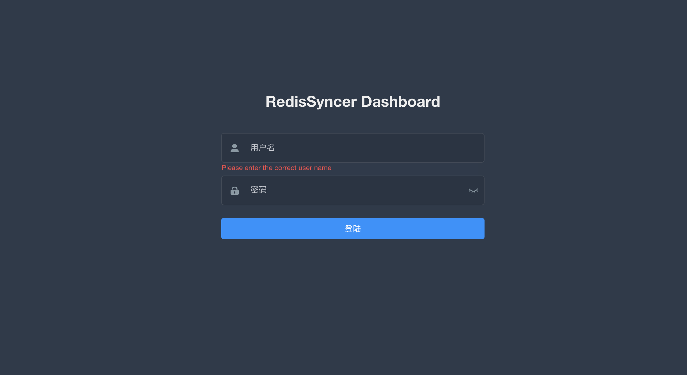

### 登录

[comment]: <> (![img]&#40;img/image-20210805102621785.png&#41;)

###  账号密码

`默认账号密码： admin 123456`

### 注意
		1.若启用权限，需要将 redissyncer-server application.yml相关配置设置为true
	 syncer:
	   config:
	     auth: false

